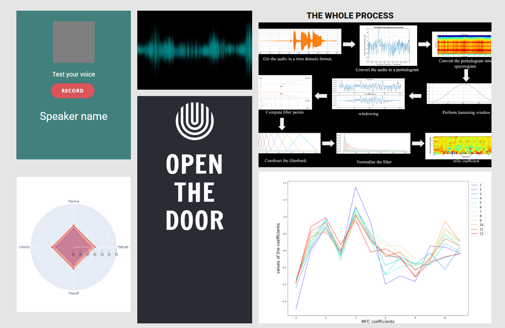

Systems and biomedical engineering, Cairo University.

3rd year, 1st semester.
### Course: Digital signal processing, Task 3 

### Members
| Team Members' Names                                  | Section| B.N. |
|------------------------------------------------------|:------:|:----:|
| [Marina Nasser](https://github.com/MarinaNasser)     |    2   |  12  |
| [Yousef Adham ](https://github.com/joeadham)         |    2   |  55  |
| [Mohab Mohamed ](https://github.com/MohabGhobashy)   |    2   |  39  |
| [Omnia Sayed  ](https://github.com/omniaSayed)       |    1   |  14  |


# Voice Recognition Security Web Application


[](https://www.python.org/downloads/release/python-380/)
[](https://www.javascript.com/)

A web application that uses voice recognition technology as a security measure. To gain access, an authorized individual must speak a specific sentence. Only team members have the authority to "Open the door" through the application.

## Technologies Used

The web application is built using the following technologies:

- Front-end:
  - JavaScript
  - CSS
  - PlotlyJS
  - CanvasJS
- Back-end:
  - Flask (Python)
- Voice recognition:
  - GMM (Gaussian Mixture Models)

## Features

Some of the features of this application include:

- The web application will only open when a team member says "open the door". If someone else tries, it will not open.
- The system can recognize whether the correct password has been spoken, and it can detect who said it and show their name.
- After speaking the password, a variety of graphs are displayed that provide information about the voice, such as the score after comparing the voice to the stored teams' voices.

## Installation

1. Clone the repository.
2. Create a virtual environment and activate it.
3. Install the requirements from `requirements.txt`:
    ```bash
    pip install -r requirements.txt
    ```
4. Run the application:
    ```bash
    python app.py
    ```

## API Reference

The API endpoints for this application are:

- `POST /voice`: This endpoint is used for voice recognition.

## How to Use

1. Run the application using the above instructions.
2. Navigate to `http://localhost:5000` in your web browser.
3. When prompted, say "open the door" to gain access to the application.
4. Speak the password when prompted.
5. Graphs will be displayed showing information about the voice.

## Screenshots



